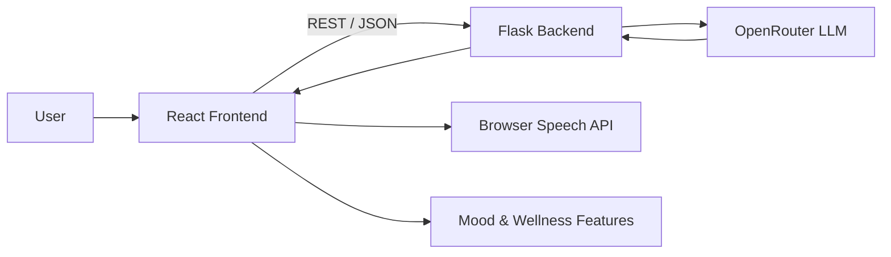

# Self Love — AI Wellness Companion

> An LLM-powered wellness companion built for the **Vyom 2025 AI Agent Showcase — Winner**.

Self Love is a voice-enabled AI wellness companion designed to make everyday emotional well-being support more accessible and interactive. The system combines a React frontend, Flask backend, and an OpenRouter-hosted LLM to provide conversational support, mood-based suggestions, bedtime stories, and wellness reminders.

## ✨ Highlights

- 💬 Conversational AI with multi-turn chat context
- 🎙️ Voice interaction using browser speech capabilities
- 🧠 Personalized responses based on the user's current mood and conversation
- 🎵 Mood-based music suggestions
- 🌙 AI-generated bedtime stories
- 🔔 Simple wellness reminders
- 🔌 REST API between the React client and Flask service
- 🤖 LLM integration through OpenRouter

## 🏆 Recognition

**Winner — Vyom 2025 AI Agent Showcase**

The project was developed as a team project for the Vyom 2025 AI Agent Showcase.

## 🧩 Architecture



### Request flow

1. The user enters text or uses voice input.
2. React packages the interaction and sends it to the Flask API.
3. Flask builds the prompt with the current conversation context and wellness-oriented instructions.
4. The backend sends the request to an LLM through OpenRouter.
5. The generated response is returned as JSON.
6. The frontend renders the response and can trigger related wellness features.

## 🛠️ Tech Stack

| Layer | Technologies |
|---|---|
| Frontend | React, JavaScript, HTML, CSS |
| Backend | Python, Flask |
| AI | OpenRouter API, LLMs |
| Interaction | Browser Speech API |
| API style | REST / JSON |

## 📁 Project Structure

```
AI-Wellness-Assistant-project/
├── backend/
│   ├── app.py
│   └── requirements.txt
├── frontend/
│   ├── package.json
│   ├── index.html
│   └── src/
│       ├── App.jsx
│       ├── main.jsx
│       └── styles.css
├── docs/
│   └── ARCHITECTURE.md
├── .env.example
├── .gitignore
└── README.md
```

## 🚀 Local Setup

### 1. Clone the repository

```bash
git clone https://github.com/nikhil-247/AI-Wellness-Assistant-project.git
cd AI-Wellness-Assistant-project
```

### 2. Configure the backend

```bash
cd backend
python -m venv .venv
```

Windows:

```bash
.venv\Scripts\activate
```

macOS/Linux:

```bash
source .venv/bin/activate
```

```bash
pip install -r requirements.txt
```

Create a `.env` file from `.env.example` and add your OpenRouter API key and model.

Start the API:

```bash
python app.py
```

### 3. Start the frontend

In a second terminal:

```bash
cd frontend
npm install
npm run dev
```

Open the local URL printed by Vite.

## 🔐 Environment Variables

```env
OPENROUTER_API_KEY=your_key_here
OPENROUTER_MODEL=your_openrouter_model
FRONTEND_ORIGIN=http://localhost:5173
```

**Never commit API keys or production secrets.**

## 🧪 API

### Health check

`GET /api/health`

### Chat

`POST /api/chat`

Example body:

```json
{
  "message": "I had a stressful day",
  "mood": "stressed",
  "history": []
}
```

Example response:

```json
{
  "reply": "That sounds like a difficult day..."
}
```

### Bedtime story

`POST /api/story`

Example body:

```json
{
  "theme": "calm forest",
  "mood": "relaxed"
}
```

## 🎯 What I Worked On

My contribution focused on the AI application layer and integration:

- Designed the conversational interaction flow and wellness-oriented prompting.
- Integrated the Flask API with OpenRouter for LLM-powered responses.
- Connected the frontend interaction layer with backend REST endpoints.
- Added voice interaction and mood-driven wellness features.
- Tested the end-to-end flow across different user inputs and conversation states.

## ⚠️ Scope & Safety

This project is a **wellness companion prototype**, not a medical or mental-health diagnostic system. It should not be used as a substitute for qualified professional care or emergency services.

## 👤 Author

**Nikhil Kushwaha**  
B.Tech CSE (Data Science), RCET Bhilai — 2027

- GitHub: https://github.com/nikhil-247
- LinkedIn: https://www.linkedin.com/in/nikhil-kushwaha-265880273
